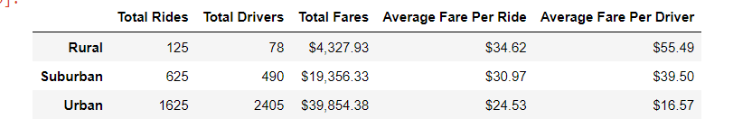

# PyBer_Analysis
## Overview of the Analysis
### Purpose of the project
The primary objective of this project was to observe and visualize trends in data generated by a ride-sharing service. The challenge assignment was particularly focused toward the grouping of cities into urban, suburban, and rural areas. By manipulating series and data frames, a statistical summary of the ridership, number of drivers, and fares in each type of city was generated. Then, the time stamps on the rides were organized by week, allowing for the creation of a three-line graph to illustrate trends in the total fares generated from each type of city over a period of several months. Ultimately, the purpose was to create recommendations for ways to make the service more accessible and affordable to residents of all three city types.

## Results
### Differences among City Types
The overall summary of city types, as shown here , illustrates some noteworthy differences, particularly between urban and rural areas. The overwhelming majority of the drivers are located in urban areas, with 2405 compared to a total of 568 in the other two city types. The total number of rides given was somewhat less extreme in its urban tendency, but there were still more than twice as many rides given in the urban cities than in the other city types. As a result, the urban cities produced more money in total fares than the suburbs or rural areas did. Fares per ride, however, were highest in the rural areas, and lowest in urban cities. Naturally, when combined with the shortage of drivers in rural areas, this also meant that the fare per driver was highest in the rural cities. By all metrics shown in the table, suburban areas ranked between urban and rural ones. Suburban cities averaged a similar fare per ride to rural areas, but the suburban driver count and average fare per driver fell soundly within the window between the urban and the rural cities.

The line graph of changes in total fares over time, seen here, illustrates that urban areas generated the most revenue, and rural areas the least, throughout the period.  Total fares collected in all three city types hit a relative peak in late February, but the three types of cities encountered different highs and lows at other times. In April, the last month visualized on the line graph, total fares were trending upward in suburban cities but downward elsewhere.

## Summary
### Recommendations for Addressing Disparities
- Firstly, the data show an inequality in terms of access to PyBer service. There are far fewer total drivers operating in suburban and rural cities than there are in rural ones. In order to improve access, PyBer should consider ways to increase the number of available drivers outside the urban cities, especially in rural areas. Similarly, it seems troublesome that the drivers in urban cities outnumber the rides given there; PyBer should look into ways to transfer some of its fleet away from the urban cities and into other areas.
- PyBer service seems to be more affordable in urban areas at the present time. Some of this may be down to supply-side factors, as the fares may be higher outside the urban cities to compensate for the lesser availability of rides. Still, more rides might be summoned in suburban and rural cities if the fare rates in those areas were made more similar to the fares in the urban cities.
- Fares per driver already seem to be much higher outside the urban cities. If drivers are paid in proportion to the fares for their trips, then this disparity could provide some incentive for drivers to branch out and cover the rural and suburban areas if possible. Such an incentive seems desirable from the standpoint of improving access to the non-urban cities, but would also potentially detract from drivers' willingness to operate in the urban areas because of the lower average fare. If the disparities in ridership and average fare persist, PyBer would do well to ensure that urban drivers are compensated in some way that allows them to continue to work with the PyBer system, whether such compensation is fare-based or not.
